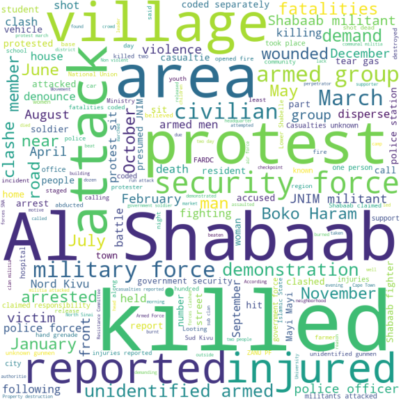
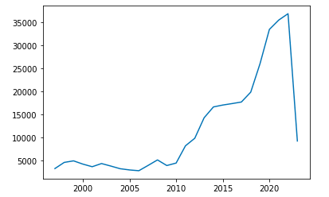
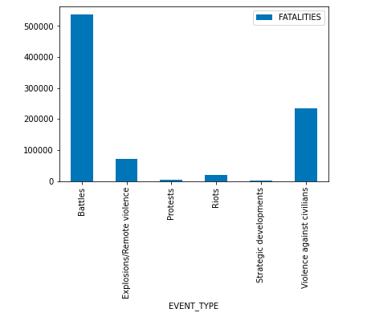
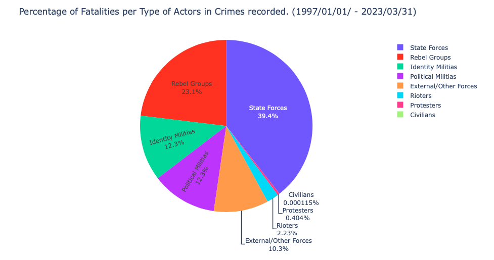
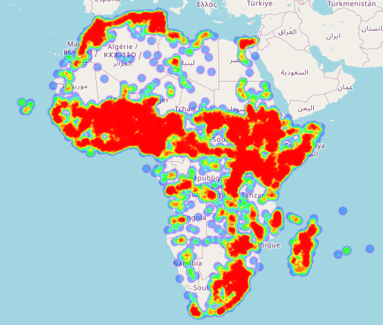
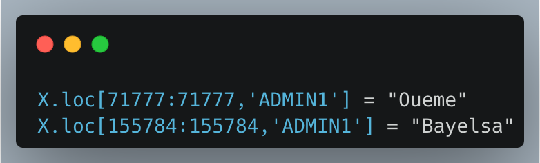
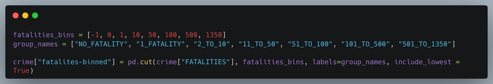
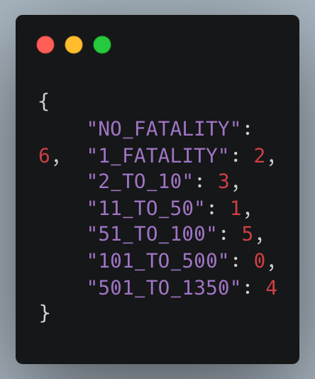
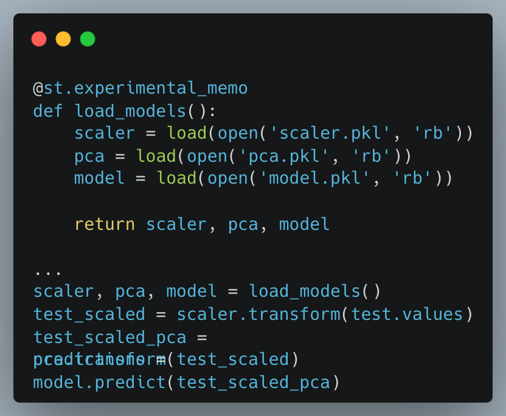

In many regions of Africa, crime has long been a major problem that is made worse by the continent's complicated social, economic, and political dynamics. With the rapid advancements in technology, there is a renewed sense of optimism in harnessing machine learning and artificial intelligence (AI) to effectively tackle crime.

By harnessing the power of data analysis and predictive algorithms, these cutting-edge technologies offer the potential to enhance crime analytics, inform pre-emptive decisions, and pave the way for a safer future across the continent.

</img>

In an attempt to devise a comprehensive solution along with my team, a problem statement was developed while also taking into consideration the dataset we decided to work with.

🤔 <b>Problem Statement</b>
 
1. To analyse crime rates and fatalities in various African countries, as well as the variations among different actors and actor groups and their contributions to total crimes and fatalities recorded.

2. To observe patterns in the trend in crime rate over the years from 1997 to 2023 (March 31st), and the factors that are most dominant or differ the most in the top 3 and bottom 3 countries in terms of crime rate.

3. Build a crime analytics and forecasting tool that assesses fatalities threat level based on disorder type, actor, and possible crime events, leveraging insights from historical data to inform preemptive policy decisions.

As regards the choice of data used for this project, the go-to-resource providing unparalleled access to a vast array of pertinent information was The Armed Conflict Location & Event Data Project <a href="https://acleddata.com/" target="_blank">(ACLED)</a> which collects real-time data on the locations, dates, actors, fatalities, and types of all reported political violence and protest events around the world.

The dataset obtained from ACLED was an encoded dataset generated over years (1997 to March 31st 2023) detailing conflicts in African nations. All these are recorded in 315940 rows and 31 columns.

📊 <b>Exploratory Data Analysis</b> 
<b>Record of Crime per year</b>
</img>

The number of crimes committed per year has been steadily increasing since 2009. However, the total number of crimes recorded in 2023 is significantly lower than in previous years, as the records stop on March 31st.

Nevertheless, the total number of crimes recorded so far in 2023 exceeds the total recorded in 2011, which suggests that the rate of crime has increased significantly over the years.

<b>Event Types and Actor Involvement</b>
</img>
<blockquote><b>Battles have contributed the most to fatalities in a crime.</b></blockquote>
</img>

<b><blockquote>State Forces (as the main actors in the crime - ACTOR1) account for 39.4% of fatalities recorded (342205 deaths) in Africa between 1997 and 2023, March 31st.

<blockquote>State forces are defined as collective actors that are recognised to perform government functions, including military and police, over a given territory.</b></blockquote></blockquote>

<b>Heatmap representing Hotspots of Crime in 2022</b>
</img>
<b>Countries with Highest and Lowest Recorded Crime Rates</b>
</img>
<blockquote><h4><b>Somalia, Nigeria and DRC are the top 3 countries in terms of the number of crimes recorded having a total of 98,717 crimes between them.</b></h4></blockquote>
</img>
<blockquote><h4><b>The total number of crimes recorded in the bottom 6 countries displayed is just over 300.</b></h4></blockquote>
<h3><b>🇦🇴 Country Case Study - Angola</b></h3>
</img>

Given Angola's contradictory combination of a relatively low crime rate (3,794 total incidents) and the highest number of fatalities, it becomes crucial to investigate the distinctive factors that contribute to this anomaly in comparison to other countries.

</img>

We can observe that the majority of crimes that have occurred in Angola are battles which from the dataset generally always resulted in a high number of fatalities.

While also reviewing the actors that have contributed the most to crimes in Angola, the military forces in Angola have been most active versus the National Union for the Total Independence of Angola (UNITA).

</img>

The annual crime records show that the crime rate in Angola was significantly higher from 1997 to 2001 than in other years.

</img>

This period coincides with the <a href="https://en.wikipedia.org/wiki/Angolan_Civil_War" >Angolan Civil War</a> that lasted from 1975 to 2002. From my research, the collapse of the Angolan economy in the late 1990s due to a combination of factors, including the war, the fall of oil prices, and corruption led to widespread poverty and unemployment, which created conditions that were ripe for crime.

<h3><b>🚨 Influence of Actor Types in Crimes</h3></b>

In this section, we delve into a comprehensive analysis of actor types and their involvement in crime, focusing on the top three countries with the highest crime rate and the bottom three countries with the lowest crime rate.

Influence of different actor types in the Top 3 countries.
Considering <b>Somalia, Nigeria,</b> and <b>the Democratic Republic of Congo:</b>

Actor Type 1

</img>

Actor Type 2

</img>
<h3><b> Influence of different actor types in the Bottom 3 countries </h3></b>

Considering <b>Equatorial Guinea, Sao Tome and Principe,</b> and <b>Seychelles:</b>

<b>Actor Type 1</b>
</img>
<b>Actor Type 2</b>
</img>
<b>FINDINGS:</b>

The analysis reveals that a significant portion of fatalities in both high and low-crime-rate countries can be attributed to the main actor (type) in crime, encoded as INTER1. In both cases, these actors bear the responsibility for the majority of the fatalities, highlighting their substantial impact on crime dynamics.

However, when comparing high-crime-rate countries to low-crime-rate countries, a noticeable distinction emerges. Rebel Groups, Political Militias, and Identity Militias, encoded as INTER2, INTER3, and INTER4 respectively, are scarce in countries with lower crime rates, while they prevail in high crime-rate countries. This observation underscores the higher prevalence of these actor types in regions characterized by elevated crime levels.

In high crime-rate countries, violence against civilians emerges as one of the most prevalent forms of crime. The interaction between the Military and Rebels, exemplified by civil war violence between state forces and rebel actors, dominates the crime landscape. This finding suggests a significant involvement of armed conflicts and internal unrest in high crime-rate countries, contributing to a higher risk of violence against civilians.

Conversely, in low crime-rate countries, violence against other groups takes centre stage. This category encompasses international organizations, state forces operating outside their main country of operation, private security firms and their armed employees, as well as independently acting hired mercenaries. Within this context, the most common interaction in low crime-rate countries involves the Military versus Civilians, encompassing activities such as state repression of civilians and arrests by the police. This finding suggests a different manifestation of crime dynamics, with a greater focus on maintaining internal security and law enforcement against specific groups.

<b>CONCLUSION:</b>

The analysis provides valuable insights into the varying patterns of actor involvement in crime in high and low-crime-rate countries. While high crime-rate countries exhibit a prevalence of State Forces, Rebel Groups, Political Militias, and Identity Militias, resulting in violence against civilians, low crime-rate countries primarily experience violence directed towards other groups, with an emphasis on the Military versus Civilians interaction.

Understanding these distinctions sheds light on the complex interplay between actor types and crime dynamics. Such insights can inform policymakers, security agencies, and researchers in developing targeted strategies to address crime-related challenges, tailored to the specific contexts and prevalent actor types in their respective regions.

<h3><b>🧹 Data Cleaning</b></h3>

The dataset has 315940 records with over 60% null values. So, to ensure that our data doesn’t have bias, we took a closer look at the missing values per column.

The ADMIN1 field, which represents the largest sub-national administrative region in which the event took place, had only two missing values in the dataset. These missing values corresponded to the locations "Gulf of Guinea" and "Coast of Benin" in the dataset. The missing values were then replaced individually with the appropriate regions for these locations: Bayelsa and Oueme, respectively.

</img>

<h3><b>⚙️ Feature Selection and Engineering</b></h3>

For feature selection, columns with no missing data were chosen except for ADMIN1 which was manually filled after searching for the right value based on other columns. Selected features include event date, event type, sub-event type, and ACTOR1.

One hot encoding was performed on categorical features with fewer categories while label encoding was used for columns with a large number of categorical variables. The target variable (Fatalities) was binned into seven categories/levels. The training set was then scaled using the standard scaler and dimensionality was reduced to 98 components from 121 using Principal Component Analysis(PCA).

<b>Fatalities</b> were binned into <b>seven</b> labels to train the model for a categorical solution after attempts to build a regression model on fatalities gave poor results.

</img>

The output of these commands is shown below:

</img>

<h3><b>📈 Model Training and Evaluation</b></h3>

The <code>XGBClassifier</code> algorithm from <code>xgboost</code> was used to train the model on the pre-processed dataset. The target variable chosen was Fatalities, which was binned into seven categories/levels.

To address the class imbalance in the target variable, we used the <code>class_weight</code> parameter from the <code>utils</code> module in the Scikit-learn library to compute sample weights based on the target variable's distribution. The generated sample weights were then passed into the <code>xgboost</code> model during fitting to improve the model's ability to handle the imbalance. This resulted in a trained model that can effectively predict the target variable with high accuracy.

Evaluating the model, we got an f1-score of 0.70 and a precision of 0.77 which are very good for the size of the dataset.

<blockquote>The model can further be improved in the future leveraging deep learning algorithms.</blockquote>

And for the wrong predictions, the majority fell to the next level in the range of fatalities, which means our model generalised well on the dataset.

</img>

<h3><b>🚀 Deployment of Solution</b></h3>

As I worked on this part, I realized that the logic behind deploying a machine learning model, especially one that has been trained on multiple features and has undergone a series of feature selection and engineering techniques, is much more complex than simply running a plug-and-play test in a notebook.

Conditional statements were used extensively, and a sample of the encoded training data was retained as a demonstration of new training data. We run a simulation of different scenarios based on the location and disorder type selected. The simulation is based on the history of the location, and it generates predictions. Our solution then returns two best-case scenarios and two worst-case scenarios.

The fitted <code>StandardScaler</code> and <code>PCA</code> models were saved as pickle files along with the <code>xgboost</code> model. They are loaded in and called in sequence, like a pipeline, for predictions.

</img>

We built a crime analytics and forecasting tool that assesses the threat level of fatalities based on disorder types, actors, and possible crime events.

This tool is built as a web application using <b>Streamlit</b> and deployed using <b>Streamlit Community Cloud.</b> The dataset referenced by the web app is hosted on the cloud using <b>Azure Blob Storage.</b> All components of the <b>web app</b> can be found in the GitHub repo.

